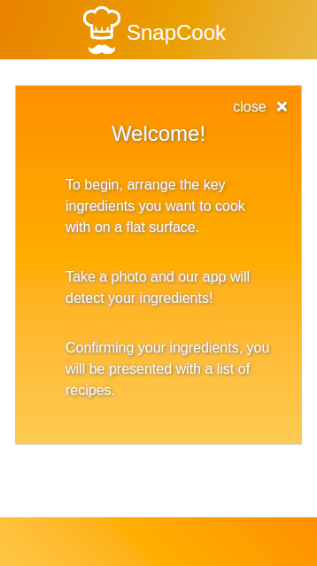

# SnapCook

This is a recipe generating app that allows users to take photos of raw food ingredients and be provided with recipes containing those ingredients.

## Screenshots

 

 	
 	

 

 	
 	

 

 	
 	

 

 	
 	

 

 	
 	

 

 	
 	

  
## API's Used

- Clarifai
- Spoonacular
- Firebase
